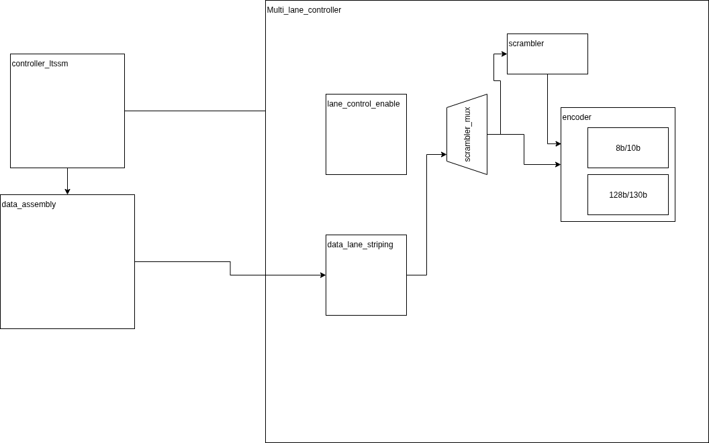

# pcie_physical

# About
Implementation of Physical Logical layer PCI Express Base Specification Revision 5.0 Version 1.0




# Simulator choice
- Xilinx Simulator
- Verilator

# Build Tool
- Fusesoc


# How to

## How to Run lint
```sh
poetry run fusesoc --cores-root=.  --verbose  run --target=lint --setup --build --run pcie:physical:top:0.1
```

## Simulate top level
```sh
poetry run fusesoc --cores-root=.  --verbose  run --target=xilinx_sim --setup --build --run pcie:physical:top:0.1
```

## How to run COCOTB simulation with verilator
```sh
cd src/tb/cocotb
make clean sim
```


## How to Run OpenLane / LibreLane Synthesis PnR Tools

1) Open a nix-shell
```sh
nix-shell --pure ~/librelane/shell.nix
```
2) Target json config file
```sh
librelane librelane_config.json --overwrite
```

## How to Run Vivado Synth
```sh
```